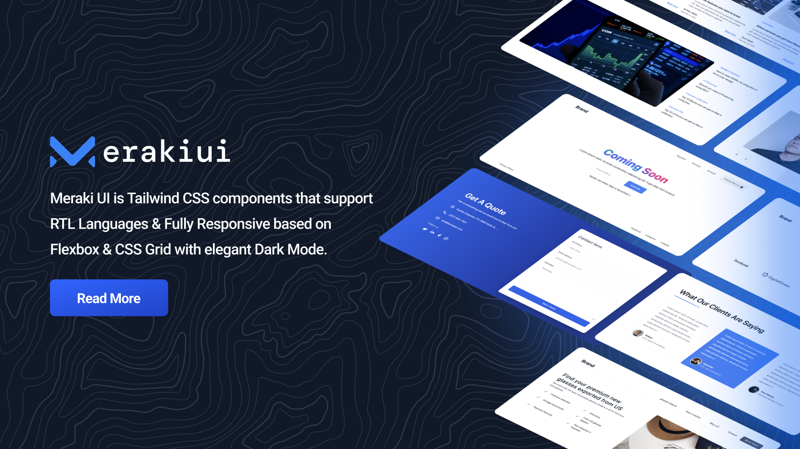

    

## Meraki UI

🎉 🚀 Meraki UI is a collection of responsive Tailwind CSS components that enhance the user experience of your website. With support for RTL languages, and a sleek Dark Mode, it makes your website look great on any device.

### Resources

-   [Tailwind CSS](https://tailwindcss.com)
-   [Unsplash](https://unsplash.com)
-   [Freepik Stories](https://stories.freepik.com)
-   [AlpineJS](https://alpinejs.dev)
-   [Heroicons](https://heroicons.dev)
-   [Coolicons](https://coolicons.cool)

### Credits

-   [Mosab Ibrahim](https://twitter.com/miaababikir)
-   [Khatab Wedaa](https://twitter.com/khatabwedaa)
-   [All Contributors](../../contributors)

### License

The MIT License (MIT). Please see [License File](https://github.com/merakiui/merakiui/blob/main/LICENSE) for more information.
